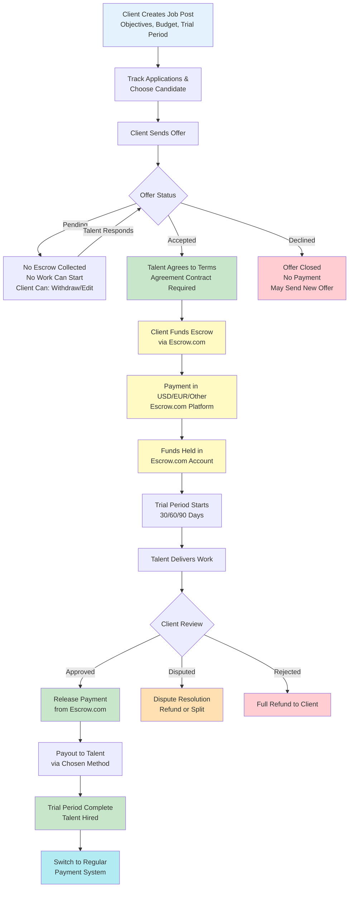
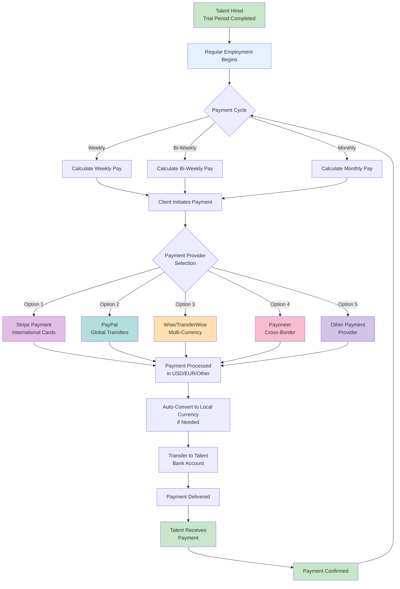
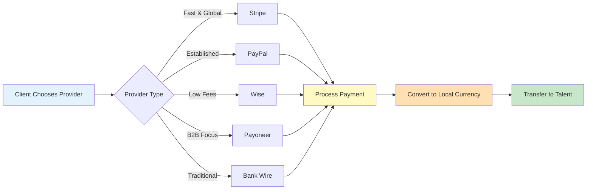
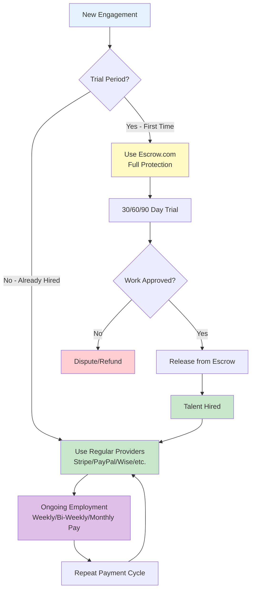

# Payment & Escrow Documentation

**Complete Guide to Trial Period Payments via Escrow.com and Regular Employee Payments**

Version 1.0 | February 2026

---

## Table of Contents

1. [Overview](#overview)
2. [Payment Methods Summary](#payment-methods-summary)
3. [Complete Payment Flows](#complete-payment-flows)
   - [Trial Period Escrow Flow](#trial-period-escrow-flow)
   - [Regular Payment Flow](#regular-payment-flow)
4. [Offer States & Transitions](#offer-states-transitions)
5. [Payment Gateway Integration](#payment-gateway-integration)
6. [Trial Period Management](#trial-period-management)
7. [Regular Payment Processing](#regular-payment-processing)
8. [Important Notes & Requirements](#important-notes-requirements)

---

## Overview

This documentation outlines the complete payment and escrow process for managing trial period payments (30/60/90 days) and regular payouts. The system uses **Escrow.com** for trial period fee protection, ensuring both client and talent security during the evaluation period.

### Key Benefits

- **Client Protection:** Trial period fees held securely until work is approved
- **Talent Security:** Payment guaranteed once work is accepted
- **Dispute Resolution:** Fair mediation process for disagreements
- **Flexible Payouts:** Multiple payment options for regular compensation

---

## Payment Methods Summary

The platform uses **two distinct payment systems** based on employment phase:

| Payment Type | Service Provider | Use Case | Currency |
|--------------|------------------|----------|----------|
| **Trial Period Fees** (30/60/90 days) | **Escrow.com** | Protected trial evaluation payments with buyer/seller protection | USD/EUR/Other |
| **Regular Payouts** (Post-Hire) | Stripe, PayPal, Wise, Payoneer, or Others | Ongoing employee compensation after successful trial completion | Multiple options available |

> **Important Distinction:** Escrow.com is used ONLY for trial period payments where both parties need protection during the evaluation phase. Once an employee is hired after a successful trial, the payment system switches to standard payment providers (Stripe, PayPal, Wise, etc.) for regular ongoing compensation.

---

## Complete Payment Flows

### Trial Period Escrow Flow

#### Trial Period Steps (via Escrow.com)

**Step 1: Job Post Creation**
- Client creates job post with objectives, budget, and trial period (30/60/90 days)

**Step 2: Application Review**
- Client tracks applications and selects preferred candidate

**Step 3: Offer Submission**
- Client sends formal offer to chosen talent

**Step 4: Offer Pending State**
- Offer awaits talent response - no escrow collected, no work can start

**Step 5: Offer Response**
- Talent either accepts or declines the offer

**Step 6: Escrow Funding**
- Upon acceptance, client funds escrow via **Escrow.com** platform

**Step 7: Escrow Holding**
- Funds held securely in Escrow.com account - trial period begins

**Step 8: Work Delivery**
- Talent delivers work during trial period (30/60/90 days)

**Step 9: Client Review**
- Client evaluates deliverables and makes decision

**Step 10: Payment Release**
- Approved work triggers payment release from Escrow.com

**Step 11: Payout Processing**
- Funds transferred to talent via chosen payment method

**Step 12: Trial Complete**
- Talent successfully completes trial period

**Step 13: System Transition**
- Payment system switches from Escrow.com to regular payment provider

---

### Regular Payment Flow

#### Regular Payment Steps (Post-Hire)

After successful trial completion and talent hire, the payment system transitions to standard payment providers for ongoing compensation:

**Step 1: Employment Begins**
- Talent is officially hired after successful trial period

**Step 2: Payment Cycle Setup**
- Establish payment frequency (weekly, bi-weekly, or monthly)

**Step 3: Work Period**
- Talent performs regular duties according to contract

**Step 4: Payment Calculation**
- System calculates compensation based on hours/salary

**Step 5: Payment Provider Selection**
- Client chooses payment method: Stripe, PayPal, Wise, Payoneer, etc.

**Step 6: Payment Initiation**
- Client initiates payment through selected provider

**Step 7: Payment Processing**
- Provider processes payment in agreed currency (USD/EUR/other)

**Step 8: Currency Conversion**
- Auto-convert to talent's local currency if needed

**Step 9: Bank Transfer**
- Funds transferred to talent's bank account

**Step 10: Payment Delivery**
- Payment delivered through standard banking channels

**Step 11: Payment Confirmation**
- Talent receives payment, cycle repeats

---

## Offer States & Transitions

### Pending State

When an offer is first sent, it enters the **PENDING** state with the following characteristics:

- No escrow funds collected from client
- No work can commence
- No financial impact or commitment
- Client retains full control to withdraw or modify offer
- Talent has not yet responded

### Offer Accepted State

Upon talent acceptance:

- Talent agrees to all terms and conditions
- Client is required to fund escrow immediately
- Trial period becomes eligible to start
- Agreement contract is activated
- Escrow collection process initiates

### Offer Declined State

If talent declines the offer:

- Offer is permanently closed
- No payment is collected
- Client may send a new offer with revised terms
- No obligations created for either party

### Critical Rules

| Rule | Description |
|------|-------------|
| **Escrow Collection** | Escrow is NEVER collected unless an offer is accepted by the talent |
| **Pending Offers** | Pending offers have NO financial impact on either party |
| **Work Commencement** | Tests and work CANNOT start unless the offer is accepted AND funded |
| **Agreement Contract** | A formal agreement contract MUST be in place before any work begins |

---

## Payment Gateway Integration

### Escrow.com Integration (Trial Period Payments ONLY)

Escrow.com serves as the secure payment escrow service for trial period fees, providing protection for both clients and talents during the 30/60/90 day evaluation period.

#### Process Flow

1. **Escrow Setup:** Client creates escrow transaction on Escrow.com platform
2. **Payment Deposit:** Client deposits funds into Escrow.com account
3. **Secure Holding:** Funds held in escrow during trial period
4. **Work Completion:** Talent completes deliverables
5. **Release/Dispute:** Client approves and releases payment, or initiates dispute
6. **Final Transfer:** Upon release, funds transferred to talent's account

#### Technical Details

| Component | Details |
|-----------|---------|
| **Service Provider** | Escrow.com (secure third-party escrow service) |
| **Supported Currencies** | USD, EUR, GBP, and other major currencies |
| **Payment Methods** | Credit/Debit Cards, Bank Transfer, Wire Transfer |
| **Escrow Period** | Duration of trial period (30/60/90 days) |
| **Dispute Resolution** | Built-in mediation service |
| **Transfer to Talent** | Direct to talent's preferred payment method |
| **Fees** | Escrow service fees apply (typically split or paid by client) |

---

### Regular Payment Providers (Post-Hire Compensation)

After successful trial completion and talent hire, clients can use various payment providers for ongoing regular compensation. These are standard payment transactions without escrow protection.

#### Available Payment Providers

| Provider | Best For | Currencies | Features |
|----------|----------|------------|----------|
| **Stripe** | Credit card payments, International clients | USD, EUR, GBP, 135+ currencies | • Fast processing • Low fees • Global coverage • Auto currency conversion |
| **PayPal** | Quick transfers, Global standard | USD, EUR, 25+ currencies | • Instant transfers • Buyer/seller protection • Wide acceptance • Mobile app |
| **Wise (TransferWise)** | Multi-currency, Low fees | USD, EUR, 50+ currencies | • Real exchange rates • Very low fees • Multi-currency account • Fast transfers |
| **Payoneer** | Cross-border B2B, Marketplace payments | USD, EUR, GBP, 150+ currencies | • Mass payout system • Local receiving accounts • Low withdrawal fees • Business-focused |
| **Bank Wire** | Large amounts, Traditional method | All major currencies | • Direct bank transfer • Secure • Higher fees • 2-5 day processing |

> **Implementation Note:** The platform should allow clients to select their preferred payment provider during the regular payment setup. Integration with these providers can be done via their respective APIs for automated payment processing.

---

## Trial Period Management

### Escrow.com Service

Escrow.com manages the complete escrow process for trial period payments:

- **Secure Setup:** Client creates escrow transaction on Escrow.com platform
- **Trial Period Tracking:** Monitor the 30/60/90 day evaluation period
- **Secure Holding:** Funds held throughout the trial in original currency
- **Duration Options:** 30, 60, or 90 days as agreed in the offer
- **Release Control:** Client controls payment release upon work approval

### Work Delivery Phase

During the trial period, talent works on deliverables according to the agreed objectives:

- Talent has full duration of trial period to complete objectives
- Client may monitor progress as per agreement terms
- Communication channels established for feedback
- Deliverables submitted according to milestones

### Client Review & Decision

At the conclusion of the trial period, the client reviews deliverables and makes a final decision:

| Decision | Outcome | Next Steps |
|----------|---------|------------|
| **Approved** | Work meets or exceeds expectations | • Payment released from escrow • Contract continues • Regular payout process begins |
| **Disputed** | Work quality or deliverables contested | • Dispute resolution initiated • Evidence reviewed • Payment refunded or split based on resolution |
| **Rejected** | Work does not meet requirements | • Full refund to client • Contract terminated • Documented for both parties |

---

## Regular Payment Processing

### Payment Cycle Setup

After successful trial completion, establish the regular payment schedule:

**Payment Frequency Options:**
- **Weekly:** Pay every 7 days
- **Bi-Weekly:** Pay every 14 days (2 weeks)
- **Monthly:** Pay once per month

### Payment Provider Selection

Clients choose from available payment providers based on their needs:

### Payout Process

**Step-by-Step Regular Payout:**

1. **Calculate Pay:** System calculates based on hours worked or salary agreement
2. **Initiate Payment:** Client approves and initiates payment via chosen provider
3. **Process Payment:** Provider processes in source currency (USD/EUR/etc.)
4. **Currency Conversion:** Automatic conversion to talent's local currency if needed
5. **Bank Transfer:** Funds sent to talent's bank account
6. **Payment Delivery:** Standard banking transfer completed
7. **Confirmation:** Talent receives payment and confirms receipt

---

## Important Notes & Requirements

### 1. Mandatory Agreement Contract

Before any escrow funds are collected or work commences, a formal agreement contract must be established between client and talent. This contract should include:

- Detailed scope of work and deliverables
- Trial period duration (30, 60, or 90 days)
- Payment amount and currency
- Success criteria and evaluation metrics
- Dispute resolution procedures
- Termination conditions
- Intellectual property rights
- Confidentiality and non-disclosure terms

### 2. Two Distinct Payment Systems

**Critical Understanding:** The platform operates TWO separate payment systems based on employment phase:

| Phase | Payment System | Protection Level | When It Applies |
|-------|----------------|------------------|-----------------|
| **Trial Period** (30/60/90 days) | Escrow.com | **FULL ESCROW PROTECTION** | • Initial evaluation period • First-time engagements • Testing talent fit • Deliverable-based work |
| **Regular Employment** (Post-Trial) | Stripe, PayPal, Wise, Payoneer, etc. | **STANDARD PAYMENT NO ESCROW** | • After successful trial • Ongoing employment • Regular salary/wages • Recurring payments |

#### Why Two Systems?

- **Trial Period:** Escrow.com provides necessary protection when parties are unknown to each other
- **Regular Employment:** After trial success, trust is established and standard payments are more efficient
- **Cost Efficiency:** Escrow fees are justified for trial protection but unnecessary for ongoing employment
- **Speed & Flexibility:** Regular payment providers offer faster processing and more payment options

> **Important:** This dual-system approach balances security during the high-risk trial phase with efficiency and cost-effectiveness for ongoing employment relationships.

### 3. Currency Conversion Considerations

For international payments, currency conversion occurs at multiple points in the process:

**Trial Period Flow:**
- **Client Payment:** USD, EUR, or other currencies via Escrow.com
- **Escrow Holding:** Held in source currency in Escrow.com account
- **Release & Transfer:** Converted to talent's local currency as needed
- **Talent Payout:** Disbursed in local currency to talent's account

**Regular Payment Flow:**
- **Client Payment:** Any supported currency via chosen provider
- **Provider Processing:** Processed in source currency
- **Auto-Conversion:** Converted to talent's local currency if needed
- **Talent Receives:** Local currency in bank account

> **Important:** Exchange rates and conversion fees should be clearly communicated to both parties before offer acceptance. Consider implementing a rate lock mechanism or transparent rate disclosure.

### 4. Compliance & Record Keeping

Maintain comprehensive records for all transactions:

**Trial Period Records:**
- Offer acceptance timestamps
- Escrow.com transaction IDs and receipts
- Escrow deposit and release documentation
- Dispute records and resolutions
- All communication logs between parties

**Regular Payment Records:**
- Payment provider transaction IDs
- Payout confirmations and bank transfer details
- Payment cycle documentation
- Tax withholding records (if applicable)
- Employment contract and amendments

> These records are essential for audit trails, dispute resolution, tax compliance, and regulatory requirements in both source and destination jurisdictions.

### 5. Dispute Resolution Process

**Trial Period Disputes (via Escrow.com):**
1. Client or talent initiates dispute in Escrow.com platform
2. Both parties submit evidence and documentation
3. Escrow.com mediator reviews case
4. Decision made: full release, full refund, or split payment
5. Funds disbursed according to resolution

**Regular Payment Disputes:**
1. Issue raised through platform support
2. Platform mediator reviews contract and evidence
3. Payment provider may be involved if payment issue
4. Resolution negotiated between parties
5. Platform documents resolution for future reference

### 6. Security & Fraud Prevention

**Trial Period Security:**
- Escrow.com provides buyer and seller protection
- Identity verification required for both parties
- Secure fund holding during evaluation
- Dispute resolution if fraud suspected

**Regular Payment Security:**
- Payment providers have built-in fraud detection
- Two-factor authentication required
- Transaction monitoring for suspicious activity
- Chargeback protection (varies by provider)

---

## Summary

This payment and escrow system provides a secure, transparent framework for managing trial period engagements between clients and talent. By leveraging **Escrow.com** for trial period fee protection and maintaining flexibility with multiple payment providers for regular payouts, the platform balances security needs with operational efficiency.

### Key Takeaways

1. Trial period fees are fully protected through Escrow.com until work is approved
2. No financial commitment occurs until talent accepts the offer
3. Agreement contracts are mandatory before work commencement
4. Multiple payment providers available for regular talent compensation
5. Clear transition from trial escrow to regular payment system
6. Transparent dispute resolution pathways protect both parties
7. Two distinct systems optimize for security (trial) and efficiency (ongoing)

### Payment System at a Glance

